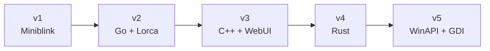
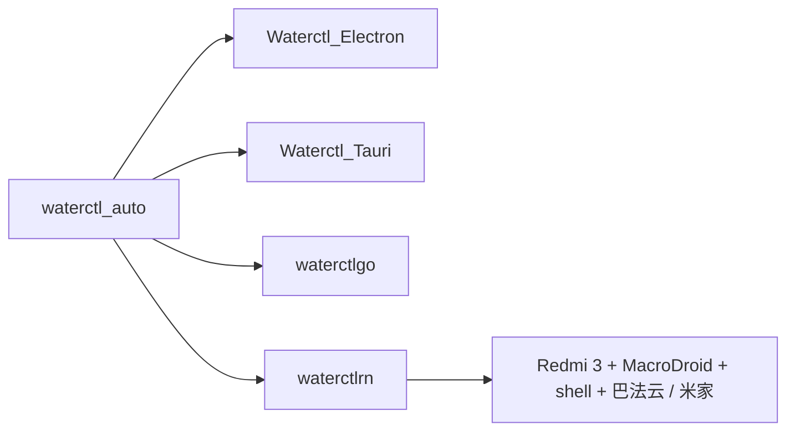

# E7G / Repository Map

> Repository index for [E7G](https://github.com/E7G).  
> Projects are grouped by relationship and purpose rather than creation time.

`ACTIVE` ongoing work · `WIP` experimental / incomplete · `STABLE` mostly finished · `ARCHIVE` historical / reference

_Last updated: 2026-09-14_

---

## Map

```mermaid
flowchart TD
    ROOT["E7G"]

    ROOT --> DEVICE["Device / Linux"]
    ROOT --> ANDROID["Android"]
    ROOT --> CAMPUS["Classroom / Campus"]
    ROOT --> PAPER["Classpaper"]
    ROOT --> NET["Network / OpenWrt / NAS"]
    ROOT --> DESKTOP["Desktop Tools"]
    ROOT --> ARCHIVE["Archive / Experiments"]

    DEVICE --> LATTE["Mi Pad 2 · latte"]
    LATTE --> LINUX["linux_latte"]
    LATTE --> FLASH["xiaomi-latte-flash_tools"]

    DEVICE --> CLOVER["Mi Pad 4 · clover / SDM660"]
    CLOVER --> DROID["Droidspaces-rootfs-KDE-builder"]
    DROID --> KERNEL["android_kernel_xiaomi_sdm660_clover_avium"]
    DROID --> MESA["mesa-for-android-container"]
    DROID --> WAYLAND["anland / wlroots-anland / labwc"]

    ANDROID --> YAMF["BetterYAMF"]
    ANDROID --> WINLATOR["winlator"]
    ANDROID --> C001["c001apk-flutter"]
    ANDROID --> XPOSED["LSPosed / System Tweaks"]

    CAMPUS --> HELPER["classhelper"]
    CAMPUS --> HOMEWORK["HomeworkInfoSync"]
    CAMPUS --> OCS["OCS / Chaoxing / Question Bank"]
    CAMPUS --> PORTAL["Campus Network"]

    PAPER --> CP1["v1 · Miniblink"]
    PAPER --> CP2["v2 · Go / Lorca"]
    PAPER --> CP3["v3 · C++ / WebUI"]
    PAPER --> CP4["v4 · Rust"]
    PAPER --> CP5["v5 · WinAPI / GDI"]

    NET --> LUCI["LuCI Apps"]
    NET --> PROXY["OpenWrt-momo / OpenWrt-nikki"]
    NET --> FNOS["fnOS / NAS"]

    DESKTOP --> CLEANER["wincleaner"]
    DESKTOP --> RPA["simpleRPA"]
    DESKTOP --> OCR["ShareX-RapidOCR"]

    ARCHIVE --> WATER["waterctl family"]
    ARCHIVE --> MEDIA["Media / Web / Small Experiments"]
```



### Main routes

| Route | Core repositories | Status |
| --- | --- | --- |
| Mi Pad 2 Linux | [`linux_latte`](https://github.com/E7G/linux_latte) · [`xiaomi-latte-flash_tools`](https://github.com/E7G/xiaomi-latte-flash_tools) | `ACTIVE` |
| Mi Pad 4 / Droidspaces | [`Droidspaces-rootfs-KDE-builder`](https://github.com/E7G/Droidspaces-rootfs-KDE-builder) · clover kernel · Mesa / Wayland stack | `ACTIVE` |
| Android floating window | [`BetterYAMF`](https://github.com/E7G/BetterYAMF) | `ACTIVE` |
| Classroom assistant | [`classhelper`](https://github.com/E7G/classhelper) | `ACTIVE` |
| Classpaper | v1 → v5 | `STABLE` |
| waterctl | Electron / Tauri / Go / React Native | `ARCHIVE` |

---

## Device / Linux

### Mi Pad 2 · latte

| Repository | Status | Role |
| --- | --- | --- |
| [`linux_latte`](https://github.com/E7G/linux_latte) | `ACTIVE` | Linux 6.14 device-support kernel tree |
| [`xiaomi-latte-flash_tools`](https://github.com/E7G/xiaomi-latte-flash_tools) | `WIP` | GPT / EFI / fastboot / image flashing tools |

`linux_latte` device coverage:

```text
Mi Pad 2 · latte
├─ Intel i915 display / GPU
├─ LCD backlight
├─ FTSC1000 touchscreen
├─ capacitive bezel keys
├─ BCM4356 Wi-Fi / Bluetooth
├─ RT5659 + TFA9890 audio
├─ USB host / gadget / serial debug
├─ battery / charger
├─ IIO sensors / LEDs
├─ OV5693 front camera          [experimental]
└─ T4KA3 + AtomISP rear camera [experimental]
```

Camera support and suspend/resume peripheral recovery remain the main regression areas.

### Mi Pad 4 · clover / SDM660

**Core:** [`Droidspaces-rootfs-KDE-builder`](https://github.com/E7G/Droidspaces-rootfs-KDE-builder) `ACTIVE`

```text
Android / Droidspaces
        │
        ├─ Debian / Ubuntu / Fedora / Arch Linux ARM
        ├─ KDE Plasma / Plasma Mobile
        ├─ Termux:X11
        ├─ Anland / Wayland
        ├─ PulseAudio / PipeWire
        ├─ zh_CN / Fcitx5
        └─ Snapdragon KGSL / Mesa
                 │
                 └─ Mi Pad 4 · clover
```

| Repository | Role |
| --- | --- |
| [`android_kernel_xiaomi_sdm660_clover_avium`](https://github.com/E7G/android_kernel_xiaomi_sdm660_clover_avium) | clover / SDM660 kernel, Droidspaces and ReKSU experiments |
| [`mesa-for-android-container`](https://github.com/E7G/mesa-for-android-container) | Mesa / Snapdragon GPU stack for Android containers |
| [`anland`](https://github.com/E7G/anland) | Android ↔ Wayland bridge work |
| [`wlroots-anland`](https://github.com/E7G/wlroots-anland) | wlroots + Anland integration |
| [`labwc`](https://github.com/E7G/labwc) | lightweight Wayland compositor experiments |
| [`archlinuxarm-PKGBUILDs`](https://github.com/E7G/archlinuxarm-PKGBUILDs) | Arch Linux ARM package builds |
| [`libva-v4l2-stateful`](https://github.com/E7G/libva-v4l2-stateful) | V4L2 stateful / VA-API experiments |
| [`avium-build`](https://github.com/E7G/avium-build) | Avium / clover build helpers |

---

## Android

| Repository | Status | Focus |
| --- | --- | --- |
| [`BetterYAMF`](https://github.com/E7G/BetterYAMF) | `ACTIVE` | reYAMF fork; HyperOS-style gestures, floating-window interaction, cleanup and stability |
| [`winlator`](https://github.com/E7G/winlator) | `WIP` | Windows x86/x64 apps and games on Android; Wine / Proton / Box64 / graphics compatibility |
| [`c001apk-flutter`](https://github.com/E7G/c001apk-flutter) | `WIP` | third-party CoolApk Flutter client; localization, feed, images and login fixes |
| [`FakeDCBacklight`](https://github.com/E7G/FakeDCBacklight) | `WIP` | backlight / pseudo-DC dimming experiments |
| [`ScreenshotTile-LSPosed`](https://github.com/E7G/ScreenshotTile-LSPosed) | `WIP` | screenshot quick-tile / LSPosed integration |
| [`DouyinEasyGo-LSPosed-v1.5.20`](https://github.com/E7G/DouyinEasyGo-LSPosed-v1.5.20) | `WIP` | LSPosed module branch |
| [`douyinlowlikefilter`](https://github.com/E7G/douyinlowlikefilter) | `WIP` | content-filter experiment |

### BetterYAMF flow

```text
gesture
  ↓
real-touch animation
  ↓
edge handoff
  ↓
floating window
  ├─ overview / rotation fixes
  ├─ orphan-window cleanup
  └─ floating-ball recovery
```

---

## Classroom / Campus

### classhelper

[`classhelper`](https://github.com/E7G/classhelper) `ACTIVE`

```text
microphone
   │
   ▼
  ASR ───────────────→ transcript
   │                       │
   │                       ├─ notes / context
   │                       │
   └─ continuous class     ▼
       recognition        LLM
                           │
                           └─ QA / assist
```

Related work includes Chaoxing / KETANGPAI course resources, mobile preview, high-DPI UI and continuous classroom ASR.

### Course / homework toolchain

```text
HomeworkInfoSync
├─ Chaoxing / Xuexitong
├─ KETANGPAI
└─ Rain Classroom

ocsjs-with-uxy
├─ ocs-helper
├─ tikulocal
└─ chaoxing_ulearning_Answer_to_Word
```

| Repository | Role |
| --- | --- |
| [`HomeworkInfoSync`](https://github.com/E7G/HomeworkInfoSync) | multi-platform homework information sync |
| [`ocsjs-with-uxy`](https://github.com/E7G/ocsjs-with-uxy) | OCS-derived online-course helper branch |
| [`ocs-helper`](https://github.com/E7G/ocs-helper) | Chaoxing playback / navigation helper |
| [`tikulocal`](https://github.com/E7G/tikulocal) | local question-bank API |
| [`chaoxing_ulearning_Answer_to_Word`](https://github.com/E7G/chaoxing_ulearning_Answer_to_Word) | answer export to Word |
| [`chaoxing-signin`](https://github.com/E7G/chaoxing-signin) | Chaoxing sign-in related tool |
| [`ketangpai-downloader`](https://github.com/E7G/ketangpai-downloader) | KETANGPAI resource helper |

### Campus network / lab

- [`luci-app-campusportal`](https://github.com/E7G/luci-app-campusportal) — LuCI frontend for campus portal authentication
- [`cisco-pt-mcp`](https://github.com/E7G/cisco-pt-mcp) — Cisco Packet Tracer / MCP experiments

---

## Classpaper



| Generation | Repository | Implementation |
| --- | --- | --- |
| v1 | [`ClassPaper`](https://github.com/E7G/ClassPaper) | Miniblink + web frontend; first Classpaper compatibility layer |
| v2 | [`Classpaper-v2`](https://github.com/E7G/Classpaper-v2) | Go + Lorca; later cgo / WinAPI integration |
| v3 | [`Classpaper-v3`](https://github.com/E7G/Classpaper-v3) | C++ + WebUI; desktop embedding and click-through |
| v4 | [`Classpaper-v4`](https://github.com/E7G/Classpaper-v4) | Rust rewrite |
| v5 | [`Classpaper-v5`](https://github.com/E7G/Classpaper-v5) | WinAPI / GDI; browser layer removed; ~40 KB class implementation |

Companion tool: [`lessonlistchanger`](https://github.com/E7G/lessonlistchanger) — timetable creation / conversion.

---

## Network / OpenWrt / NAS

```text
router / nas
├─ luci-app-campusportal
├─ luci-app-adblock-lean
├─ OpenWrt-momo
├─ OpenWrt-nikki
├─ cliproxyapi-fnos
└─ xiaoai-speaker
```

| Repository | Role |
| --- | --- |
| [`luci-app-campusportal`](https://github.com/E7G/luci-app-campusportal) | campus portal LuCI app |
| [`luci-app-adblock-lean`](https://github.com/E7G/luci-app-adblock-lean) | adblock-lean LuCI frontend |
| [`OpenWrt-momo`](https://github.com/E7G/OpenWrt-momo) | OpenWrt proxy integration branch |
| [`OpenWrt-nikki`](https://github.com/E7G/OpenWrt-nikki) | OpenWrt proxy integration branch |
| [`cliproxyapi-fnos`](https://github.com/E7G/cliproxyapi-fnos) | CLIProxyAPI / fnOS integration |
| [`xiaoai-speaker`](https://github.com/E7G/xiaoai-speaker) | XiaoAI speaker / TTS experiments |

---

## Desktop Tools

| Repository | Stack / purpose |
| --- | --- |
| [`wincleaner`](https://github.com/E7G/wincleaner) | Rust + Freya Windows cleanup utility |
| [`simpleRPA`](https://github.com/E7G/simpleRPA) | Python RPA; recording, keyboard/mouse, image click and loops |
| [`ShareX-RapidOCR`](https://github.com/E7G/ShareX-RapidOCR) | ShareX + RapidOCR integration |
| [`MiMoCode-Desktop`](https://github.com/E7G/MiMoCode-Desktop) | MiMoCode desktop client |
| [`wmpf-debugger-rust`](https://github.com/E7G/wmpf-debugger-rust) | Rust debugger experiment |
| [`Quickary`](https://github.com/E7G/Quickary) | lightweight utility experiment |

---

## waterctl family

`ARCHIVE`



| Repository | Implementation |
| --- | --- |
| [`waterctl_auto`](https://github.com/E7G/waterctl_auto) | original automation branch |
| [`Waterctl_Electron`](https://github.com/E7G/Waterctl_Electron) | Electron |
| [`Waterctl_Tauri`](https://github.com/E7G/Waterctl_Tauri) | Tauri |
| [`waterctlgo`](https://github.com/E7G/waterctlgo) | Go |
| [`waterctlrn`](https://github.com/E7G/waterctlrn) | React Native |

Purpose: work around the water-controller disconnect cycle and keep hot-water control automated. The final deployment used a dedicated Redmi 3 with MacroDroid / shell automation. Firmware and service changes eventually retired this route.

---

## Archive / Experiments

### Media

- [`PiliNara`](https://github.com/E7G/PiliNara)
- [`media-kit`](https://github.com/E7G/media-kit)
- [`MKOnlineMusicPlayer`](https://github.com/E7G/MKOnlineMusicPlayer)
- [`kuwo_flac_decrypt`](https://github.com/E7G/kuwo_flac_decrypt)
- [`my-iptv`](https://github.com/E7G/my-iptv)

### Development / Web

- [`interactive-image-map`](https://github.com/E7G/interactive-image-map)
- [`appmaker`](https://github.com/E7G/appmaker)
- [`cptr_toolkits`](https://github.com/E7G/cptr_toolkits)
- [`esp32c3-things`](https://github.com/E7G/esp32c3-things)
- [`ts2c`](https://github.com/E7G/ts2c)
- [`pylib`](https://github.com/E7G/pylib)

### Reference / Forks

- [`Some-collected-surface-rt-information-files`](https://github.com/E7G/Some-collected-surface-rt-information-files)
- [`Google-Mirrors`](https://github.com/E7G/Google-Mirrors)
- [`pandownload.com_Pages_Backup`](https://github.com/E7G/pandownload.com_Pages_Backup)
- [`pandownload-fake-server`](https://github.com/E7G/pandownload-fake-server)
- [`baidupan-rapidupload`](https://github.com/E7G/baidupan-rapidupload)
- [`baiduwp-php`](https://github.com/E7G/baiduwp-php)

---

## Timeline

```text
web / scripts
      ↓
Classpaper ──────────────┐
waterctl                 │
      ↓                  │
campus automation        │
      ↓                  │
Android / OpenWrt        │
      ↓                  │
Droidspaces / Linux      │
      ↓                  │
Mi Pad device work  ←────┘
```

This repository is the map. Project-specific documentation stays with each project.
