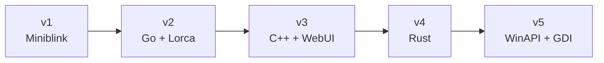
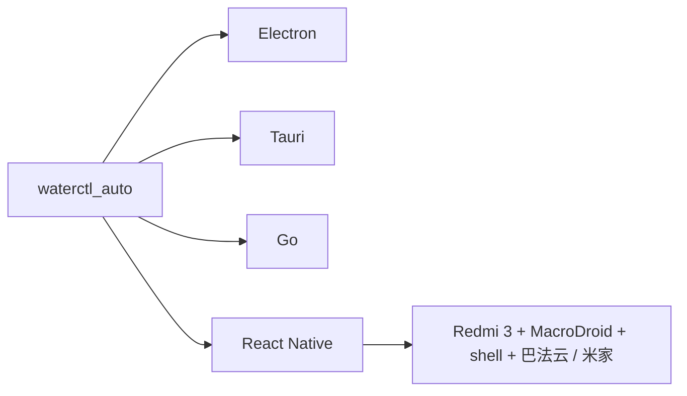

# E7G Repository Map

> 我的项目地图。按项目之间的关系整理，而不是按创建时间罗列仓库。
>
> 安装、构建和具体使用方式以各项目自己的 README 为准。

_Last updated: 2026-09-14_

```mermaid
flowchart TD
    E7G["E7G"]

    E7G --> DEVICE["设备 / Linux"]
    E7G --> ANDROID["Android"]
    E7G --> CLASS["课堂 / 校园"]
    E7G --> CLASSPAPER["Classpaper"]
    E7G --> NET["网络 / OpenWrt / NAS"]
    E7G --> DESKTOP["桌面工具"]
    E7G --> OLD["历史项目 / 实验"]

    DEVICE --> LATTE["Mi Pad 2 · latte"]
    LATTE --> LINUXLATTE["linux_latte"]
    LATTE --> LATTEFLASH["xiaomi-latte-flash_tools"]

    DEVICE --> CLOVER["Mi Pad 4 · clover"]
    CLOVER --> DROID["Droidspaces-rootfs-KDE-builder"]
    DROID --> CLOVERKERNEL["android_kernel_xiaomi_sdm660_clover_avium"]
    DROID --> MESA["mesa-for-android-container"]
    DROID --> WAYLAND["Anland / wlroots / labwc"]

    ANDROID --> YAMF["BetterYAMF"]
    ANDROID --> WINLATOR["winlator"]
    ANDROID --> C001["c001apk-flutter"]
    ANDROID --> XPOSED["LSPosed / 系统增强实验"]

    CLASS --> HELPER["classhelper"]
    CLASS --> HOMEWORK["HomeworkInfoSync"]
    CLASS --> OCS["OCS / 超星 / 题库工具链"]

    CLASSPAPER --> CP1["v1 · Miniblink"]
    CLASSPAPER --> CP2["v2 · Go / Lorca"]
    CLASSPAPER --> CP3["v3 · C++ / WebUI"]
    CLASSPAPER --> CP4["v4 · Rust"]
    CLASSPAPER --> CP5["v5 · WinAPI / GDI"]

    NET --> CAMPUS["luci-app-campusportal"]
    NET --> ADBLOCK["luci-app-adblock-lean"]
    NET --> PROXY["OpenWrt-momo / OpenWrt-nikki"]
    NET --> FNOS["cliproxyapi-fnos"]

    DESKTOP --> CLEANER["wincleaner"]
    DESKTOP --> RPA["simpleRPA"]
    DESKTOP --> OCR["ShareX-RapidOCR"]

    OLD --> WATER["waterctl 系列"]
    OLD --> MEDIA["媒体 / Web / 小实验"]
```



## 设备 / Linux

### Mi Pad 2 · latte

**[linux_latte](https://github.com/E7G/linux_latte)**  
小米平板 2 的 Linux 设备支持树，当前基于 Linux 6.14。

```text
Mi Pad 2
├─ kernel 6.14
├─ i915 / display / backlight
├─ FTSC1000 touch + capacitive keys
├─ BCM4356 Wi-Fi / Bluetooth
├─ RT5659 + TFA9890 audio
├─ USB host / gadget / serial debug
├─ battery / charger / IIO sensors / LEDs
├─ OV5693 front camera
└─ T4KA3 rear camera + AtomISP   [experimental]
```

摄像头仍是整套支持里最需要继续打磨的部分；Suspend / Resume 后的外设恢复也保留回归测试。

**[xiaomi-latte-flash_tools](https://github.com/E7G/xiaomi-latte-flash_tools)**  
配套刷写工具。GPT、EFI / fastboot、boot/root 镜像等都放在这一侧处理。

`linux_latte` + `xiaomi-latte-flash_tools` 基本组成了现在的 Mi Pad 2 Linux 路线。

---

### Mi Pad 4 · clover / SDM660

**[Droidspaces-rootfs-KDE-builder](https://github.com/E7G/Droidspaces-rootfs-KDE-builder)**  
Android 容器里的桌面 Linux RootFS 构建器，也是 Mi Pad 4 这条路线的中心。

```text
Droidspaces RootFS
├─ Debian 13
├─ Ubuntu 24.04 / 25.10 / 26.04
├─ Fedora 43 / 44
├─ Arch Linux ARM
├─ KDE Plasma / Plasma Mobile
├─ Termux:X11
├─ Anland / Wayland
├─ PulseAudio / PipeWire
├─ zh_CN + Fcitx5
└─ Snapdragon / KGSL GPU support
```

Mi Pad 4 相关仓库：

| Repository | Role |
| --- | --- |
| [android_kernel_xiaomi_sdm660_clover_avium](https://github.com/E7G/android_kernel_xiaomi_sdm660_clover_avium) | clover / SDM660 内核与 Droidspaces、ReKSU 方向实验 |
| [mesa-for-android-container](https://github.com/E7G/mesa-for-android-container) | Android 容器里的 Mesa / Snapdragon GPU 适配 |
| [anland](https://github.com/E7G/anland) | Android ↔ Wayland 图形桥接相关修改 |
| [wlroots-anland](https://github.com/E7G/wlroots-anland) | wlroots + Anland 实验 |
| [labwc](https://github.com/E7G/labwc) | 轻量 Wayland compositor 实验 |
| [archlinuxarm-PKGBUILDs](https://github.com/E7G/archlinuxarm-PKGBUILDs) | Arch Linux ARM 软件包构建 |
| [libva-v4l2-stateful](https://github.com/E7G/libva-v4l2-stateful) | V4L2 stateful / VA-API 实验 |
| [avium-build](https://github.com/E7G/avium-build) | Avium / clover 构建辅助 |

## Android

### [BetterYAMF](https://github.com/E7G/BetterYAMF)

reYAMF 的性能与交互增强分支，目标是让第三方小窗更接近系统原生行为。

```text
gesture
  ↓
real-touch animation
  ↓
edge handoff
  ↓
small window
  ├─ rotation / overview fixes
  ├─ orphan window cleanup
  └─ floating-ball recovery
```

### [winlator](https://github.com/E7G/winlator)

Android 上运行 Windows x86/x64 应用和游戏的实验分支。主要用于 Wine / Proton、Box64、图形栈以及不同设备的兼容性测试。

### [c001apk-flutter](https://github.com/E7G/c001apk-flutter)

第三方酷安 Flutter 客户端分支。主要修改中文界面、动态内容、图片显示和登录相关功能。

### 其他

- [FakeDCBacklight](https://github.com/E7G/FakeDCBacklight) — 背光 / 类 DC 调光实验
- [ScreenshotTile-LSPosed](https://github.com/E7G/ScreenshotTile-LSPosed) — 系统截图快捷功能
- [DouyinEasyGo-LSPosed-v1.5.20](https://github.com/E7G/DouyinEasyGo-LSPosed-v1.5.20) — LSPosed 模块分支
- [douyinlowlikefilter](https://github.com/E7G/douyinlowlikefilter) — 内容过滤实验

## 课堂 / 校园

这条线从早期的网课脚本，慢慢长成了课程信息、课堂辅助和本地工具链。

### [classhelper](https://github.com/E7G/classhelper)

ASR + LLM 课堂助手。

```text
microphone
   ↓
ASR ─────→ transcript
   ↓            ↓
continuous   notes / context
classroom        ↓
recognition     LLM
                 ↓
             QA / assist
```

同时接入课堂派、超星等课程资源，处理移动端预览、高 DPI 界面和课堂连续识别。

### [HomeworkInfoSync](https://github.com/E7G/HomeworkInfoSync)

多平台作业信息同步：超星 / 学习通、课堂派、长江雨课堂等。

### 网课工具链

```text
ocsjs-with-uxy
      │
      ├── ocs-helper
      │
      ├── tikulocal
      │
      └── chaoxing_ulearning_Answer_to_Word

other
├── chaoxing-signin
└── ketangpai-downloader
```

- [ocsjs-with-uxy](https://github.com/E7G/ocsjs-with-uxy)
- [ocs-helper](https://github.com/E7G/ocs-helper)
- [tikulocal](https://github.com/E7G/tikulocal)
- [chaoxing_ulearning_Answer_to_Word](https://github.com/E7G/chaoxing_ulearning_Answer_to_Word)
- [chaoxing-signin](https://github.com/E7G/chaoxing-signin)
- [ketangpai-downloader](https://github.com/E7G/ketangpai-downloader)

### 校园网络

- [luci-app-campusportal](https://github.com/E7G/luci-app-campusportal) — 校园网认证的 LuCI 前端
- [cisco-pt-mcp](https://github.com/E7G/cisco-pt-mcp) — Cisco Packet Tracer / MCP 实验

## Classpaper

Classpaper 是一条已经收得比较完整的项目线。



| Generation | Repository | Idea |
| --- | --- | --- |
| v1 | [ClassPaper](https://github.com/E7G/ClassPaper) | Miniblink + 网页前端；开始设计 Classpaper 兼容层 |
| v2 | [Classpaper-v2](https://github.com/E7G/Classpaper-v2) | Go + Lorca，之后通过 cgo / WinAPI 补足桌面能力 |
| v3 | [Classpaper-v3](https://github.com/E7G/Classpaper-v3) | C++ + WebUI，重做桌面穿透和窗口承载 |
| v4 | [Classpaper-v4](https://github.com/E7G/Classpaper-v4) | Rust 重写，继续压缩底层和体积 |
| v5 | [Classpaper-v5](https://github.com/E7G/Classpaper-v5) | 放弃浏览器壳层，直接 WinAPI / GDI；40KB 级极简实现 |

**[lessonlistchanger](https://github.com/E7G/lessonlistchanger)** 是这一系列的课表制作 / 转换工具。

## 网络 / OpenWrt / NAS

```text
router / nas
├─ luci-app-campusportal   campus portal
├─ luci-app-adblock-lean  adblock-lean UI
├─ OpenWrt-momo           proxy experiment
├─ OpenWrt-nikki          proxy experiment
├─ cliproxyapi-fnos       fnOS / NAS integration
└─ xiaoai-speaker         XiaoAI / TTS experiment
```

- [luci-app-campusportal](https://github.com/E7G/luci-app-campusportal)
- [luci-app-adblock-lean](https://github.com/E7G/luci-app-adblock-lean)
- [OpenWrt-momo](https://github.com/E7G/OpenWrt-momo)
- [OpenWrt-nikki](https://github.com/E7G/OpenWrt-nikki)
- [cliproxyapi-fnos](https://github.com/E7G/cliproxyapi-fnos)
- [xiaoai-speaker](https://github.com/E7G/xiaoai-speaker)

## 桌面工具

| Repository | What it is |
| --- | --- |
| [wincleaner](https://github.com/E7G/wincleaner) | Rust + Freya GUI 的 Windows 清理工具 |
| [simpleRPA](https://github.com/E7G/simpleRPA) | Python RPA：录制、键鼠、图像点击、循环任务 |
| [ShareX-RapidOCR](https://github.com/E7G/ShareX-RapidOCR) | ShareX + RapidOCR |
| [MiMoCode-Desktop](https://github.com/E7G/MiMoCode-Desktop) | MiMoCode 桌面端 |
| [wmpf-debugger-rust](https://github.com/E7G/wmpf-debugger-rust) | Rust 调试工具实验 |
| [Quickary](https://github.com/E7G/Quickary) | 轻量工具实验 |

## waterctl

一条已经完成使命的老项目线。



- [waterctl_auto](https://github.com/E7G/waterctl_auto)
- [Waterctl_Electron](https://github.com/E7G/Waterctl_Electron)
- [Waterctl_Tauri](https://github.com/E7G/Waterctl_Tauri)
- [waterctlgo](https://github.com/E7G/waterctlgo)
- [waterctlrn](https://github.com/E7G/waterctlrn)

最初只是为了解决水控器约 7 分钟断连的问题。后来换过 Electron、Tauri、Go、React Native，最后用一台二手红米 3 长期跑自动化方案。固件和服务变化后，这条线停止继续维护。

## 其他 / 实验 / 存档

### Media

- [PiliNara](https://github.com/E7G/PiliNara)
- [media-kit](https://github.com/E7G/media-kit)
- [MKOnlineMusicPlayer](https://github.com/E7G/MKOnlineMusicPlayer)
- [kuwo_flac_decrypt](https://github.com/E7G/kuwo_flac_decrypt)
- [my-iptv](https://github.com/E7G/my-iptv)

### Development / Web

- [interactive-image-map](https://github.com/E7G/interactive-image-map)
- [appmaker](https://github.com/E7G/appmaker)
- [cptr_toolkits](https://github.com/E7G/cptr_toolkits)
- [esp32c3-things](https://github.com/E7G/esp32c3-things)
- [ts2c](https://github.com/E7G/ts2c)
- [pylib](https://github.com/E7G/pylib)

### Archive / Fork / Reference

- [Some-collected-surface-rt-information-files](https://github.com/E7G/Some-collected-surface-rt-information-files)
- [Google-Mirrors](https://github.com/E7G/Google-Mirrors)
- [pandownload.com_Pages_Backup](https://github.com/E7G/pandownload.com_Pages_Backup)
- [pandownload-fake-server](https://github.com/E7G/pandownload-fake-server)
- [baidupan-rapidupload](https://github.com/E7G/baidupan-rapidupload)
- [baiduwp-php](https://github.com/E7G/baiduwp-php)

---

```text
web / scripts
      ↓
Classpaper ──────────┐
waterctl             │
      ↓              │
campus automation    │
      ↓              │
Android / OpenWrt    │
      ↓              │
Droidspaces / Linux  │
      ↓              │
Mi Pad device work ←─┘
```

这个仓库只负责画地图。项目细节留在项目里。