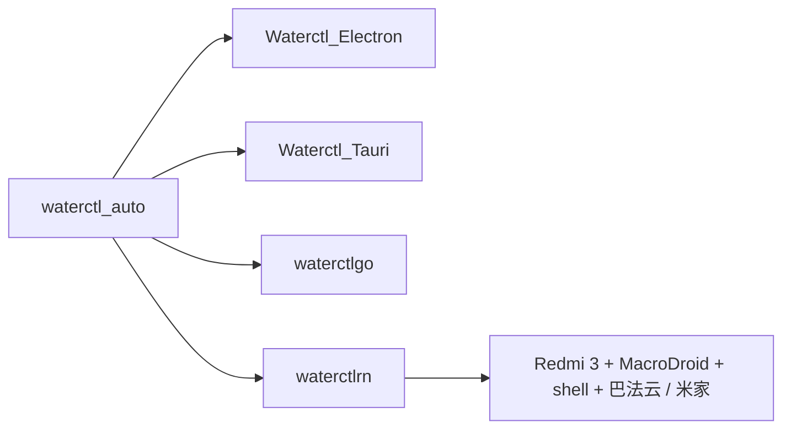

# E7G / 项目地图

> [E7G](https://github.com/E7G) 的仓库索引。  
> 按项目关系与用途整理，不按创建时间堆叠。

`ACTIVE` 持续维护 · `WIP` 开发 / 实验中 · `STABLE` 基本完成 · `ARCHIVE` 历史 / 存档

_最后整理：2026-09-14_

---

## 总览

```mermaid
flowchart TD
    ROOT["E7G"]

    ROOT --> DEVICE["设备 / Linux"]
    ROOT --> ANDROID["Android"]
    ROOT --> CAMPUS["课堂 / 校园"]
    ROOT --> PAPER["Classpaper"]
    ROOT --> NET["网络 / OpenWrt / NAS"]
    ROOT --> DESKTOP["桌面工具"]
    ROOT --> ARCHIVE["存档 / 实验"]

    DEVICE --> LATTE["小米平板 2 · latte"]
    LATTE --> LINUX["linux_latte"]
    LATTE --> FLASH["xiaomi-latte-flash_tools"]

    DEVICE --> CLOVER["小米平板 4 · clover / SDM660"]
    CLOVER --> DROID["Droidspaces-rootfs-KDE-builder"]
    DROID --> KERNEL["android_kernel_xiaomi_sdm660_clover_avium"]
    DROID --> MESA["mesa-for-android-container"]
    DROID --> WAYLAND["anland / wlroots-anland / labwc"]

    ANDROID --> YAMF["BetterYAMF"]
    ANDROID --> WINLATOR["winlator"]
    ANDROID --> C001["c001apk-flutter"]
    ANDROID --> XPOSED["LSPosed / 系统增强"]

    CAMPUS --> HELPER["classhelper"]
    CAMPUS --> HOMEWORK["HomeworkInfoSync"]
    CAMPUS --> OCS["OCS / 超星 / 题库工具链"]
    CAMPUS --> PORTAL["校园网"]

    PAPER --> CP1["v1 · Miniblink"]
    PAPER --> CP2["v2 · Go / Lorca"]
    PAPER --> CP3["v3 · C++ / WebUI"]
    PAPER --> CP4["v4 · Rust"]
    PAPER --> CP5["v5 · WinAPI / GDI"]

    NET --> LUCI["LuCI 应用"]
    NET --> PROXY["OpenWrt-momo / OpenWrt-nikki"]
    NET --> FNOS["fnOS / NAS"]

    DESKTOP --> CLEANER["wincleaner"]
    DESKTOP --> RPA["simpleRPA"]
    DESKTOP --> OCR["ShareX-RapidOCR"]

    ARCHIVE --> WATER["waterctl 系列"]
    ARCHIVE --> MEDIA["媒体 / Web / 小型实验"]
```



### 主要路线

| 路线 | 核心仓库 | 状态 |
| --- | --- | --- |
| 小米平板 2 Linux | [`linux_latte`](https://github.com/E7G/linux_latte) · [`xiaomi-latte-flash_tools`](https://github.com/E7G/xiaomi-latte-flash_tools) | `ACTIVE` |
| 小米平板 4 / Droidspaces | [`Droidspaces-rootfs-KDE-builder`](https://github.com/E7G/Droidspaces-rootfs-KDE-builder) · clover 内核 · Mesa / Wayland | `ACTIVE` |
| Android 小窗 | [`BetterYAMF`](https://github.com/E7G/BetterYAMF) | `ACTIVE` |
| 课堂助手 | [`classhelper`](https://github.com/E7G/classhelper) | `ACTIVE` |
| Classpaper | v1 → v5 | `STABLE` |
| waterctl | Electron / Tauri / Go / React Native | `ARCHIVE` |

---

## 设备 / Linux

### 小米平板 2 · latte

| 仓库 | 状态 | 定位 |
| --- | --- | --- |
| [`linux_latte`](https://github.com/E7G/linux_latte) | `ACTIVE` | 基于 Linux 6.14 的 Mi Pad 2 设备支持内核 |
| [`xiaomi-latte-flash_tools`](https://github.com/E7G/xiaomi-latte-flash_tools) | `WIP` | GPT / EFI / fastboot / 系统镜像刷写工具 |

`linux_latte` 当前覆盖：

```text
Mi Pad 2 · latte
├─ Intel i915 显示 / GPU
├─ LCD 背光
├─ FTSC1000 触摸
├─ 电容触摸按键
├─ BCM4356 Wi-Fi / Bluetooth
├─ RT5659 + TFA9890 音频
├─ USB Host / Gadget / 串口调试
├─ 电池 / 充电
├─ IIO 传感器 / LED
├─ OV5693 前摄                  [实验]
└─ T4KA3 + AtomISP 后摄         [实验]
```

主要回归点：摄像头、Suspend / Resume 后的外设恢复。

### 小米平板 4 · clover / SDM660

**核心：** [`Droidspaces-rootfs-KDE-builder`](https://github.com/E7G/Droidspaces-rootfs-KDE-builder) `ACTIVE`

```text
Android / Droidspaces
        │
        ├─ Debian / Ubuntu / Fedora / Arch Linux ARM
        ├─ KDE Plasma / Plasma Mobile
        ├─ Termux:X11
        ├─ Anland / Wayland
        ├─ PulseAudio / PipeWire
        ├─ 中文环境 / Fcitx5
        └─ Snapdragon KGSL / Mesa
                 │
                 └─ Mi Pad 4 · clover
```

| 仓库 | 定位 |
| --- | --- |
| [`android_kernel_xiaomi_sdm660_clover_avium`](https://github.com/E7G/android_kernel_xiaomi_sdm660_clover_avium) | clover / SDM660 内核、Droidspaces、ReKSU 方向 |
| [`mesa-for-android-container`](https://github.com/E7G/mesa-for-android-container) | Android 容器中的 Mesa / Snapdragon GPU 栈 |
| [`anland`](https://github.com/E7G/anland) | Android ↔ Wayland 图形桥接 |
| [`wlroots-anland`](https://github.com/E7G/wlroots-anland) | wlroots + Anland 集成 |
| [`labwc`](https://github.com/E7G/labwc) | 轻量 Wayland compositor 实验 |
| [`archlinuxarm-PKGBUILDs`](https://github.com/E7G/archlinuxarm-PKGBUILDs) | Arch Linux ARM 软件包构建 |
| [`libva-v4l2-stateful`](https://github.com/E7G/libva-v4l2-stateful) | V4L2 stateful / VA-API 实验 |
| [`avium-build`](https://github.com/E7G/avium-build) | Avium / clover 构建辅助 |

---

## Android

| 仓库 | 状态 | 方向 |
| --- | --- | --- |
| [`BetterYAMF`](https://github.com/E7G/BetterYAMF) | `ACTIVE` | reYAMF 分支；HyperOS 风格手势、小窗交互、回收与稳定性 |
| [`winlator`](https://github.com/E7G/winlator) | `WIP` | Android 上的 Windows x86/x64 应用与游戏兼容实验 |
| [`c001apk-flutter`](https://github.com/E7G/c001apk-flutter) | `WIP` | 第三方酷安 Flutter 客户端；汉化、动态、图片、登录 |
| [`FakeDCBacklight`](https://github.com/E7G/FakeDCBacklight) | `WIP` | 背光 / 类 DC 调光实验 |
| [`ScreenshotTile-LSPosed`](https://github.com/E7G/ScreenshotTile-LSPosed) | `WIP` | 截图快捷功能 / LSPosed 集成 |
| [`DouyinEasyGo-LSPosed-v1.5.20`](https://github.com/E7G/DouyinEasyGo-LSPosed-v1.5.20) | `WIP` | LSPosed 模块分支 |
| [`douyinlowlikefilter`](https://github.com/E7G/douyinlowlikefilter) | `WIP` | 内容过滤实验 |

### BetterYAMF

```text
手势
 ↓
跟手动画
 ↓
边缘接管
 ↓
小窗
 ├─ Overview / 旋转修复
 ├─ 残留窗口清理
 └─ 悬浮球状态恢复
```

---

## 课堂 / 校园

### classhelper

[`classhelper`](https://github.com/E7G/classhelper) `ACTIVE`

```text
麦克风
  │
  ▼
 ASR ─────────────→ 转写
  │                  │
  │                  ├─ 笔记 / 上下文
  │                  │
  └─ 连续课堂识别     ▼
                    LLM
                     │
                     └─ 问答 / 辅助
```

关联：课堂派 / 超星课程资源、移动端预览、连续课堂识别与界面适配。

### 课程 / 作业工具链

```text
HomeworkInfoSync
├─ 超星 / 学习通
├─ 课堂派
└─ 长江雨课堂

ocsjs-with-uxy
├─ ocs-helper
├─ tikulocal
└─ chaoxing_ulearning_Answer_to_Word
```

| 仓库 | 定位 |
| --- | --- |
| [`HomeworkInfoSync`](https://github.com/E7G/HomeworkInfoSync) | 多平台作业信息同步 |
| [`ocsjs-with-uxy`](https://github.com/E7G/ocsjs-with-uxy) | OCS 衍生网课辅助分支 |
| [`ocs-helper`](https://github.com/E7G/ocs-helper) | 超星播放 / 课程导航辅助 |
| [`tikulocal`](https://github.com/E7G/tikulocal) | 本地题库 API |
| [`chaoxing_ulearning_Answer_to_Word`](https://github.com/E7G/chaoxing_ulearning_Answer_to_Word) | 答案导出 Word |
| [`chaoxing-signin`](https://github.com/E7G/chaoxing-signin) | 超星签到相关工具 |
| [`ketangpai-downloader`](https://github.com/E7G/ketangpai-downloader) | 课堂派资源工具 |

### 校园网络 / 实验

- [`luci-app-campusportal`](https://github.com/E7G/luci-app-campusportal) — 校园网认证 LuCI 前端
- [`cisco-pt-mcp`](https://github.com/E7G/cisco-pt-mcp) — Cisco Packet Tracer / MCP 实验

---

## Classpaper


| 版本 | 仓库 | 实现 |
| --- | --- | --- |
| v1 | [`ClassPaper`](https://github.com/E7G/ClassPaper) | Miniblink + Web 前端；Classpaper 兼容层起点 |
| v2 | [`Classpaper-v2`](https://github.com/E7G/Classpaper-v2) | Go + Lorca；后续加入 cgo / WinAPI |
| v3 | [`Classpaper-v3`](https://github.com/E7G/Classpaper-v3) | C++ + WebUI；桌面嵌入与穿透 |
| v4 | [`Classpaper-v4`](https://github.com/E7G/Classpaper-v4) | Rust 重写 |
| v5 | [`Classpaper-v5`](https://github.com/E7G/Classpaper-v5) | WinAPI / GDI；移除浏览器层，约 40 KB 级实现 |

配套工具：[`lessonlistchanger`](https://github.com/E7G/lessonlistchanger) — 课表制作 / 转换。

---

## 网络 / OpenWrt / NAS

```text
路由器 / NAS
├─ luci-app-campusportal
├─ luci-app-adblock-lean
├─ OpenWrt-momo
├─ OpenWrt-nikki
├─ cliproxyapi-fnos
└─ xiaoai-speaker
```

| 仓库 | 定位 |
| --- | --- |
| [`luci-app-campusportal`](https://github.com/E7G/luci-app-campusportal) | 校园网认证 LuCI 应用 |
| [`luci-app-adblock-lean`](https://github.com/E7G/luci-app-adblock-lean) | adblock-lean LuCI 前端 |
| [`OpenWrt-momo`](https://github.com/E7G/OpenWrt-momo) | OpenWrt 代理集成分支 |
| [`OpenWrt-nikki`](https://github.com/E7G/OpenWrt-nikki) | OpenWrt 代理集成分支 |
| [`cliproxyapi-fnos`](https://github.com/E7G/cliproxyapi-fnos) | CLIProxyAPI / fnOS 集成 |
| [`xiaoai-speaker`](https://github.com/E7G/xiaoai-speaker) | 小爱音箱 / TTS 实验 |

---

## 桌面工具

| 仓库 | 技术 / 用途 |
| --- | --- |
| [`wincleaner`](https://github.com/E7G/wincleaner) | Rust + Freya 的 Windows 清理工具 |
| [`simpleRPA`](https://github.com/E7G/simpleRPA) | Python RPA；录制、键鼠、图像点击、循环任务 |
| [`ShareX-RapidOCR`](https://github.com/E7G/ShareX-RapidOCR) | ShareX + RapidOCR |
| [`MiMoCode-Desktop`](https://github.com/E7G/MiMoCode-Desktop) | MiMoCode 桌面端 |
| [`wmpf-debugger-rust`](https://github.com/E7G/wmpf-debugger-rust) | Rust 调试工具实验 |
| [`Quickary`](https://github.com/E7G/Quickary) | 轻量工具实验 |

---

## waterctl 系列

`ARCHIVE`



| 仓库 | 实现 |
| --- | --- |
| [`waterctl_auto`](https://github.com/E7G/waterctl_auto) | 自动化基础分支 |
| [`Waterctl_Electron`](https://github.com/E7G/Waterctl_Electron) | Electron |
| [`Waterctl_Tauri`](https://github.com/E7G/Waterctl_Tauri) | Tauri |
| [`waterctlgo`](https://github.com/E7G/waterctlgo) | Go |
| [`waterctlrn`](https://github.com/E7G/waterctlrn) | React Native |

用途：解决水控器周期性断连并保持自动控制。最终部署为 Redmi 3 + MacroDroid / shell 自动化；固件和服务变化后停止维护。

---

## 存档 / 实验

### 媒体

- [`PiliNara`](https://github.com/E7G/PiliNara)
- [`media-kit`](https://github.com/E7G/media-kit)
- [`MKOnlineMusicPlayer`](https://github.com/E7G/MKOnlineMusicPlayer)
- [`kuwo_flac_decrypt`](https://github.com/E7G/kuwo_flac_decrypt)
- [`my-iptv`](https://github.com/E7G/my-iptv)

### 开发 / Web

- [`interactive-image-map`](https://github.com/E7G/interactive-image-map)
- [`appmaker`](https://github.com/E7G/appmaker)
- [`cptr_toolkits`](https://github.com/E7G/cptr_toolkits)
- [`esp32c3-things`](https://github.com/E7G/esp32c3-things)
- [`ts2c`](https://github.com/E7G/ts2c)
- [`pylib`](https://github.com/E7G/pylib)

### 资料 / Fork / 存档

- [`Some-collected-surface-rt-information-files`](https://github.com/E7G/Some-collected-surface-rt-information-files)
- [`Google-Mirrors`](https://github.com/E7G/Google-Mirrors)
- [`pandownload.com_Pages_Backup`](https://github.com/E7G/pandownload.com_Pages_Backup)
- [`pandownload-fake-server`](https://github.com/E7G/pandownload-fake-server)
- [`baidupan-rapidupload`](https://github.com/E7G/baidupan-rapidupload)
- [`baiduwp-php`](https://github.com/E7G/baiduwp-php)

---

## 路线演变

```text
Web / 脚本
    ↓
Classpaper ────────────┐
waterctl               │
    ↓                  │
校园自动化              │
    ↓                  │
Android / OpenWrt      │
    ↓                  │
Droidspaces / Linux    │
    ↓                  │
设备适配 / Mi Pad  ←───┘
```

这里只画地图，项目细节留在各自仓库中。
